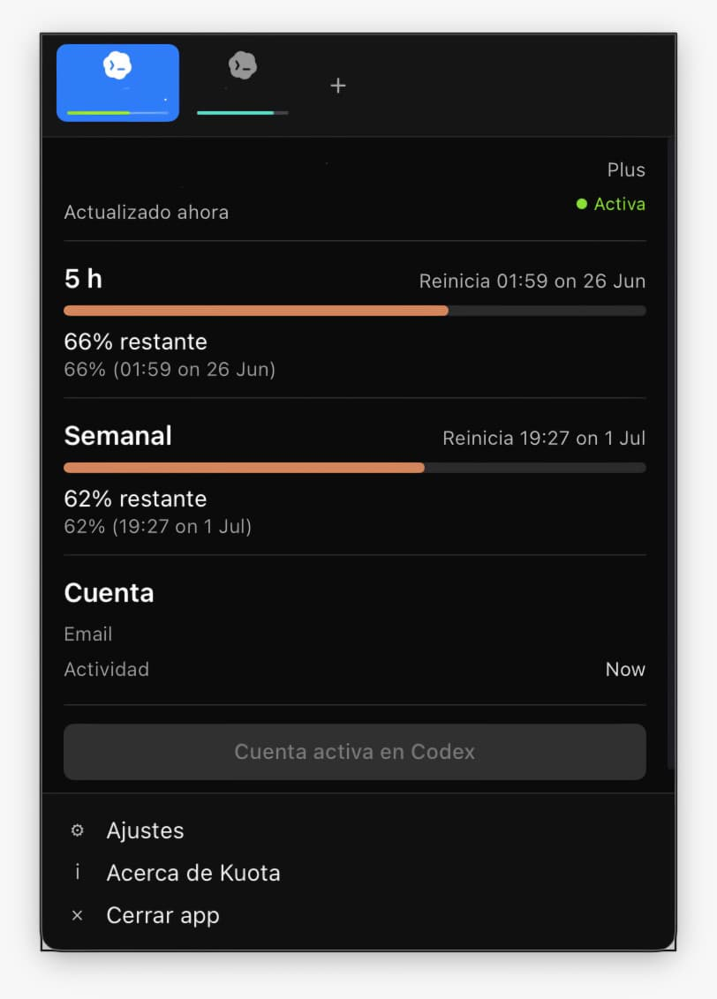
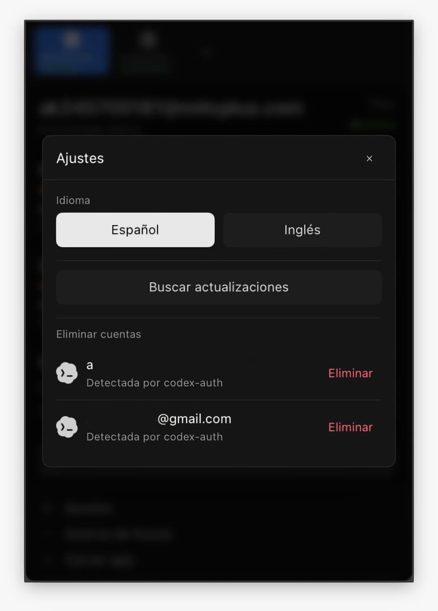

<p align="center">
  
</p>

<h1 align="center">Kuota</h1>

<p align="center">
  App de menu bar para cambiar cuentas de Codex y ver la cuota restante sin usar terminal.
</p>

---

## Que es Kuota

Kuota es una app de escritorio construida con Tauri, React y TypeScript. Su objetivo es convertir el flujo de `codex-auth` en una interfaz visual simple para usuarios que no quieren manejar cuentas desde la terminal.

La app vive en la barra del sistema:

- En macOS se despliega desde la menu bar.
- En Windows/Linux se despliega desde la bandeja inferior.
- Muestra una card por cuenta.
- Refresca el uso automaticamente cada 60 segundos.
- Permite cambiar la cuenta activa de Codex.
- Muestra el uso restante de la ventana de 5 horas y semanal.

## Base tecnica

Kuota esta basada en [loongphy/codex-auth](https://github.com/loongphy/codex-auth).

La app no usa proxy para funcionar. En su lugar, usa `codex-auth` como motor para:

- detectar cuentas disponibles;
- iniciar login guiado;
- leer el estado de cuentas;
- cambiar la cuenta activa;
- consultar el uso reportado por `codex-auth`;
- buscar e instalar actualizaciones del motor.

## Funcionamiento

### 1. Preparacion de codex-auth

Al abrir Kuota, la app revisa si `codex-auth` esta instalado.

Si no existe, Kuota puede instalarlo ejecutando:

```bash
npm install -g @loongphy/codex-auth@latest
```

Kuota necesita que Node.js y npm esten disponibles en el sistema para instalar o actualizar `codex-auth` automaticamente. Si npm no existe, la app mostrara un error y el usuario tendra que instalar Node.js primero.

Desde `Ajustes` tambien se puede buscar actualizaciones. Si hay una version nueva de `codex-auth`, Kuota intenta actualizarlo automaticamente.

### 2. Agregar cuentas

Para agregar una cuenta, Kuota abre el flujo guiado de `codex-auth login --device-auth`.

En macOS, el login se abre en Terminal para que el usuario pueda autorizar la sesion con el codigo de dispositivo. Al terminar, Kuota vuelve a consultar la lista de cuentas.

### 3. Ver cuotas

Kuota muestra la cuota restante, no la cuota consumida, para evitar confusiones.

La vista principal muestra:

- uso restante de `5 h`;
- uso restante `Semanal`;
- plan detectado;
- ultima actividad;
- cuenta activa en Codex.

La informacion se actualiza cada 60 segundos y tambien cuando la app vuelve a tomar foco.

### 4. Cambiar cuenta activa

Cuando seleccionas una cuenta y presionas `Usar en Codex`, Kuota ejecuta:

```bash
codex-auth switch <cuenta>
```

Despues intenta reiniciar o abrir Codex para que la app tome la cuenta seleccionada:

- Si Codex Desktop estaba abierto, lo cierra y lo vuelve a abrir.
- Si detecta uso de Codex CLI, abre una nueva terminal con `codex`.
- Si no detecta nada, intenta abrir Codex Desktop.

### 5. Ajustes

Desde `Ajustes` puedes:

- cambiar idioma entre Espanol e Ingles;
- buscar actualizaciones de `codex-auth`;
- eliminar u ocultar cuentas que ya no quieres ver en Kuota.

La opcion `Cerrar app` esta disponible directamente en el footer del popup.

## Interfaz

Kuota usa una interfaz compacta y oscura inspirada en herramientas de menu bar.

La ventana adapta sus esquinas segun el sistema operativo:

- macOS: esquinas inferiores redondeadas, porque el popup baja desde la menu bar.
- Windows/Linux: esquinas superiores redondeadas, porque el popup sube desde la bandeja inferior.

## Capturas

<p align="center">
  
</p>

<p align="center">
  
</p>

## Actualizaciones

Kuota busca actualizaciones desde dos fuentes:

- Kuota app: GitHub Releases mediante Tauri Updater.
- codex-auth: paquete `@loongphy/codex-auth` mediante npm.

El flujo in-app esta preparado para descargar, instalar y relanzar Kuota cuando exista una release firmada disponible. La configuracion final de releases y firma se documenta en [docs/AUTOUPDATE.md](docs/AUTOUPDATE.md).

## Desarrollo local

### Requisitos

- Node.js
- npm
- Rust
- Tauri CLI
- `codex-auth` para probar el flujo real de cuentas

### Instalar dependencias

```bash
npm install
```

### Ejecutar en modo desarrollo

```bash
npm run tauri:dev
```

### Validar TypeScript

```bash
npx tsc --noEmit
```

### Validar Rust

```bash
cd src-tauri
cargo check
```

## Stack

- Tauri 2
- React
- TypeScript
- Zustand
- Tailwind CSS
- Rust
- `@loongphy/codex-auth`

## Seguridad y privacidad

Kuota no debe incluir secretos en el frontend ni en el repositorio.

La app delega el manejo real de sesiones a `codex-auth`. Kuota solo muestra el estado disponible, permite iniciar flujos guiados y ejecuta comandos locales necesarios para cambiar de cuenta.

Este proyecto no esta afiliado oficialmente con OpenAI ni con Codex. Es una interfaz visual independiente para facilitar el uso de `codex-auth`.

## Creditos

Desarrollado por RichTunic.

Basado en el proyecto de terminal [loongphy/codex-auth](https://github.com/loongphy/codex-auth).
